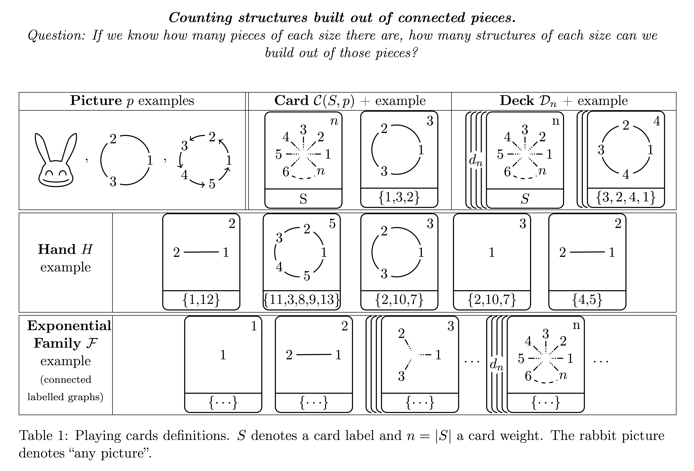

# Generatingfunctionology Cards in LaTeX


```latex
% First row
\Card[0.6]{n}{S}{ Picture }      \Deck{n}{S}{2}{ Picture }      \Deck{n}{S}{5}{ \Rabbit }      \Deck{n}{S}{a}{ Picture }

% Second row
\Card{n}{S}{ \Connected[0.7]{3} }      \Card{n}{S}{ \Connected[0.7]{n} }      \Card{n}{S}{\Cycle[0.7]{ undirected}{3} }      \Card{n}{S}{ \Cycle[0.7]{}{n} }
```

## Examples

### Card Structures



```latex
\begin{center}
\textbf{\emph{Counting structures built out of connected pieces.}}\emph{}\\
\emph{Question: If we know how many pieces of each size there are,
how many structures of each size can we build out of those pieces?}
\par\end{center}

\begin{table}[H]
\begin{centering}
\begin{tabular}{|>{\centering}m{0.12\textwidth}|c||c|c|}
\hline 
\multicolumn{2}{|c||}{\textbf{Picture} $p$ examples} & \textbf{Card} $\mathcal{C}(S,p)$ + example & \textbf{Deck} $\mathcal{D}_{n}$ + example\tabularnewline
\hline 
\multicolumn{2}{|c||}{\Rabbit[0.7], \Cycle[0.7]{undirected}{3}, \Cycle[0.7]{}{5}} &  \Card[0.7]{n}{S}{ \Connected[0.7]{n} }  \Card[0.7]{3}{\{1,3,2\}}{ \Cycle[0.7]{undirected}{3} }  & \Deck[0.7]{n}{$S$}{$d_n$}{ \Connected[0.7]{n} }\Deck[0.7]{4}{$\{3,2,4,1\}$}{3}{ \Cycle[0.7]{undirected}{4} }\tabularnewline
\hline 
\hline 
\textbf{Hand} $H$ example & \multicolumn{3}{c|}{ \Card[0.7]{2}{\{1,12\}}{ \Cycle[0.7]{undirected}{2} }  \Card[0.7]{5}{\{11,3,8,9,13\}}{ \Cycle[0.7]{undirected}{5} }  \Card[0.7]{3}{\{2,10,7\}}{ \Cycle[0.7]{undirected}{3} } 
 \Card[0.7]{3}{\{2,10,7\}}{ \Cycle[0.7]{undirected}{1} }  \Card[0.7]{2}{\{4,5\}}{ \Cycle[0.7]{undirected}{2} } }\tabularnewline
\hline 
\hline 
\textbf{Exponential Family} $\mathcal{F}$ example {\scriptsize{}(connected
labelled graphs)} & \multicolumn{3}{c|}{\Deck[0.7]{1}{\{$\cdots$\}}{1}{ \Connected[0.7]{1} }\Deck[0.7]{2}{\{$\cdots$\}}{1}{ \Connected[0.7]{2} }\Deck[0.7]{3}{\{$\cdots$\}}{4}{ \Connected[0.7]{3} }$\cdots$\Deck[0.7]{n}{\{$\cdots$\}}{$d_n$}{ \Connected[0.7]{n} }$\cdots$}\tabularnewline
\hline 
\end{tabular}
\par\end{centering}
\caption{Playing cards definitions. $S$ denotes a card label and $n=\left|S\right|$
a card weight. The rabbit picture denotes ``any picture''.}
\end{table}

```

### The Main Counting Theorems


```latex
\begin{center}
\textbf{}%
\begin{tabular}{|ccccc|}
\hline 
 &  &  &  & \tabularnewline
\multicolumn{5}{|c|}{\textbf{The fundamental lemma of labeled counting}}\tabularnewline
 &  &  &  & \tabularnewline
$\mathcal{F}$ &  & $\mathcal{F}'$ &  & $\mathcal{F}''$\tabularnewline
$\cdots$
\Deck[0.7]{r}{$S_r$}{$d_r$}{ \Rabbit[0.7] }
$\cdots$ & $=$ & $\cdots$
\Deck[0.7]{r}{$S_r$}{$d'_r$}{ \Rabbit[0.7] }
$\cdots$ & $\oplus$ & $\cdots$
\Deck[0.7]{r}{$S_r$}{$d''_r$}{ \Rabbit[0.7] }
$\cdots$\tabularnewline
$d_{r}=d'_{r}+d''_{r}$ &  &  &  & \tabularnewline
 &  & $\Downarrow$ &  & \tabularnewline
 &  &  &  & \tabularnewline
\multicolumn{5}{|c|}{$\mathcal{H}\left(x,y\right)=\mathcal{H}'\left(x,y\right)\mathcal{H}''\left(x,y\right)$}\tabularnewline
 &  &  &  & \tabularnewline
\hline 
\end{tabular}\textbf{\medskip{}
}
\par\end{center}

\begin{center}
\begin{tabular}{|c|}
\hline 
\tabularnewline
\textbf{The exponential formula (in a 'Sorcerer's Apprentice' fashion)}\tabularnewline
\tabularnewline
\textbf{The Trickle} \tabularnewline
\Deck[0.7]{}{}{0}{}
\Deck[0.7]{}{}{0}{}
\Deck[0.7]{}{}{0}{}
$\cdots$
\Deck[0.7]{r}{\{$\cdots$\}}{1}{ \Rabbit[0.7] }
$\cdots$\tabularnewline
$\downarrow\oplus$\tabularnewline
\textbf{The Flow} \tabularnewline
\Deck[0.7]{}{}{0}{}
\Deck[0.7]{}{}{0}{}
\Deck[0.7]{}{}{0}{}
$\cdots$
\Deck[0.7]{r}{\{$\cdots$\}}{$d_r$}{ \Rabbit[0.7] }
$\cdots$\tabularnewline
$\downarrow\oplus$\tabularnewline
\textbf{The Flood} \tabularnewline
\Deck[0.7]{1}{\{$\cdots$\}}{$d_1$}{ \Rabbit[0.7] }
\Deck[0.7]{2}{\{$\cdots$\}}{$d_2$}{ \Rabbit[0.7] }
\Deck[0.7]{3}{\{$\cdots$\}}{$d_3$}{ \Rabbit[0.7] }
$\cdots$
\Deck[0.7]{r}{\{$\cdots$\}}{$d_r$}{ \Rabbit[0.7] }
$\cdots$\tabularnewline
\tabularnewline
\textbf{$\Downarrow$}\tabularnewline
\tabularnewline
$\mathcal{H}\left(x,y\right)=e^{y\mathcal{D}\left(x\right)}$\tabularnewline
\tabularnewline
$nh_{n}=\sum_{k}\binom{n}{k}kd_{k}h_{n-k}\qquad\left(n\geq1;h_{0}=1\right)$\tabularnewline
\tabularnewline
\hline 
\end{tabular}
\par\end{center}
```

### The Exponential Families


```latex
\begin{sidewaystable}
\begin{centering}
\textbf{The Exponential Families}
\par\end{centering}
\centering{}%
\begin{tabular}{|c|>{\centering}p{3cm}|c|c|c|}
\hline 
$\mathcal{F}_{1}$ & Undirected graphs & $n2^{\binom{n}{2}}=\sum_{k}\binom{n}{k}kd_{k}2^{\binom{n-k}{2}},n\geq1$ & $\mathcal{H}\left(x\right)=\sum_{n\geq0}\frac{2^{\binom{n}{2}}}{n!}x^{n}$
\footnote{Convergent only for $x=0$.} & \resizebox{270pt}{!}{\Deck[0.7]{1}{\{$\cdots$\}}{1}{ \Connected[0.7]{1} }\Deck[0.7]{2}{\{$\cdots$\}}{1}{ \Connected[0.7]{2} }\Deck[0.7]{3}{\{$\cdots$\}}{4}{ \Connected[0.7]{3} }$\cdots$\Deck[0.7]{n}{\{$\cdots$\}}{$d_n$}{ \Connected[0.7]{n} }$\cdots$}\tabularnewline
\hline 
$\mathcal{F}_{2}$ & Cyclic permutations\footnote{Cyclic permutation have no fixed points. Card: cyclic permutation
(no account for fixed points); Hand: permutation (account for fixed
points).} & $\begin{array}{c}
d_{n}=\left(n-1\right)!\\
\mathcal{D}\left(x\right)=\log\frac{1}{1-x}
\end{array}$ & $\begin{array}{c}
h\left(n,k\right)=\left[\begin{array}{c}
n\\
k
\end{array}\right]\\
\mathcal{H}\left(x,y\right)=\frac{1}{\left(1-x\right)^{y}}
\end{array}$ & \resizebox{270pt}{!}{\Deck[0.7]{1}{\{$\cdots$\}}{1}{ \Cycle[0.7]{}{1} }\Deck[0.7]{2}{\{$\cdots$\}}{1}{ \Cycle[0.7]{}{2} }\Deck[0.7]{3}{\{$\cdots$\}}{2}{ \Cycle[0.7]{}{3} }$\cdots$\Deck[0.7]{n}{\{$\cdots$\}}{$d_n$}{\Cycle[0.7]{}{n} }$\cdots$}\tabularnewline
\hline 
$\mathcal{F}_{3}$ & Set partitions\footnote{N. of ways to partition $n$ objects in $k$ classes = n. of hands
of weight $n$ and $k$ cards. Order does not matter.} & $\begin{array}{c}
d_{n}=1,n\geq1\\
\mathcal{D}\left(x\right)=e^{x}-1
\end{array}$ & $\begin{array}{c}
h\left(n,k\right)=\left\{ \begin{array}{c}
n\\
k
\end{array}\right\} \\
\mathcal{H}\left(x,y\right)=e^{y\left(e^{x}-1\right)}
\end{array}$ & \resizebox{270pt}{!}{\Deck[0.7]{1}{\{$\cdots$\}}{1}{ \Rabbit[0.7] }\Deck[0.7]{2}{\{$\cdots$\}}{1}{ \Rabbit[0.7] }\Deck[0.7]{3}{\{$\cdots$\}}{1}{ \Rabbit[0.7] }$\cdots$\Deck[0.7]{n}{\{$\cdots$\}}{1}{ \Rabbit[0.7] }$\cdots$}\tabularnewline
\hline 
$\mathcal{F}_{4}$ & Involutions, etc.\footnote{Similar to $\mathcal{F}_{2}$, but only certain non-empty decks.}
$\sigma^{m}=1$ & $\begin{array}{c}
d_{n}=\begin{cases}
\left(n-1\right)! & n\backslash m\\
0 & \textrm{otherwise}
\end{cases}\\
\mathcal{D}\left(x\right)=\sum_{d\backslash m}\frac{x^{d}}{d}
\end{array}$ & $\mathcal{H}\left(x,y\right)=e^{y\sum_{d\backslash m}\frac{x^{d}}{d}}$ & \resizebox{270pt}{!}{\Deck[0.7]{1}{\{$\cdots$\}}{1}{ \Cycle[0.7]{}{1} }\Deck[0.7]{2}{\{$\cdots$\}}{1}{ \Cycle[0.7]{}{2} }\Deck[0.7]{3}{\{$\cdots$\}}{0}{ }$\cdots$\Deck[0.7]{n}{\{$\cdots$\}}{0}{ }$\cdots$}\footnote{Example of involution exponential family ($m=2$).}\tabularnewline
\hline 
$\mathcal{F}_{5}$ & Undirected cycles\footnote{2-regular graphs: every vertex has two lines.} & $\begin{array}{c}
d_{n}=\begin{cases}
\frac{\left(n-1\right)!}{2} & n\geq3\\
0 & n=1,2
\end{cases}\\
\mathcal{D}\left(x\right)=\frac{1}{2}\left[\log\frac{1}{1-x}-x-\frac{x^{2}}{2}\right]
\end{array}$ & $\mathcal{H}\left(x,y\right)=\frac{e^{-\frac{x}{2}-\frac{x^{2}}{4}}}{\sqrt{1-x}}$ & \resizebox{270pt}{!}{\Deck[0.7]{1}{\{$\cdots$\}}{0}{ }\Deck[0.7]{2}{\{$\cdots$\}}{0}{ }\Deck[0.7]{3}{\{$\cdots$\}}{2}{ \Cycle[0.7]{undirected}{3} }$\cdots$\Deck[0.7]{n}{\{$\cdots$\}}{$d_n$}{\Cycle[0.7]{undirected}{n} }$\cdots$}\tabularnewline
\hline 
$\mathcal{F}_{6}$ & 2-colored bipartite graphs & $\mathcal{D}\left(x\right)=\log\mathcal{H}\left(x\right)$ & $h_{n}=\sum_{k}\binom{n}{k}2^{k\left(n-k\right)}$ & \tabularnewline
\hline 
$\mathcal{F}_{7}$ & Rooted trees\footnote{Polya's theorem: rooted forests $\sim$ $n+1$ rooted trees. } & \multicolumn{2}{c|}{$t_{n+1}=\left(n+1\right)f_{n},\qquad\mathcal{H}\left(x\right)=e^{\mathcal{D}\left(x\right)},\qquad\mathcal{D}\left(x\right)=xe^{\mathcal{D}\left(x\right)}$} & \tabularnewline
\hline 
\end{tabular}
\end{sidewaystable}
```
